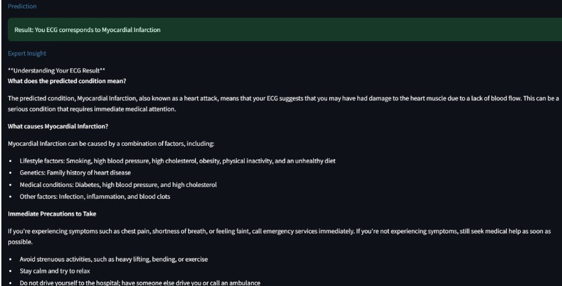
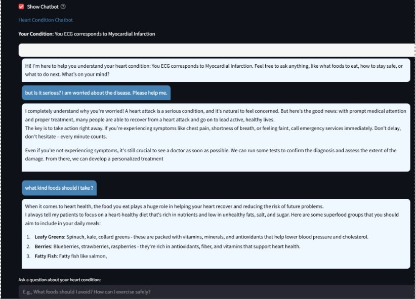
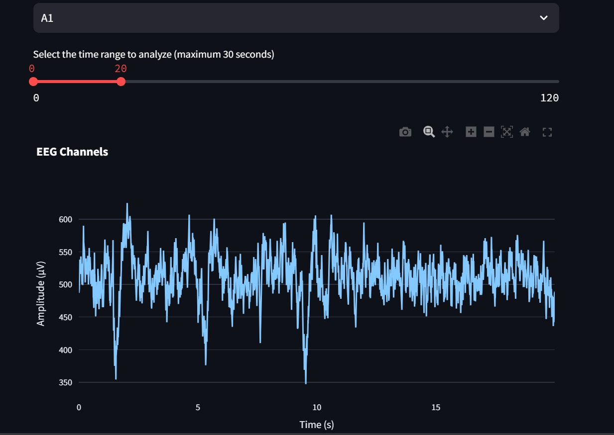
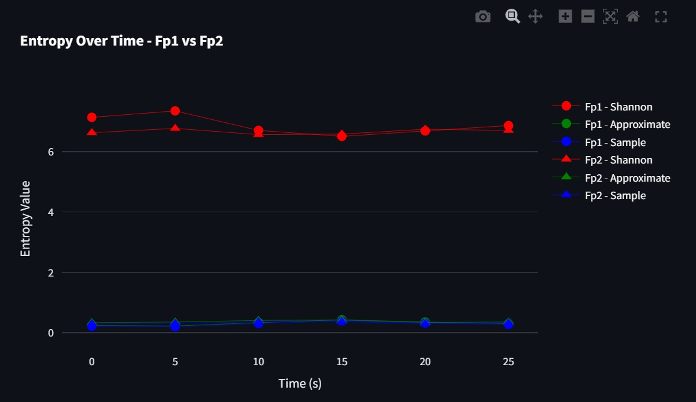

# 🧠💓 Biomedical Signal Analysis Platform


A comprehensive biomedical signal analysis platform featuring **ECG** and **EEG** analysis with machine learning classification and LLM-powered insights for medical professionals and researchers.

## 🌟 Features

### 🫀 ECG Analysis
- **Image-based ECG Processing**: Upload ECG images for automated analysis
- **12-Lead Segmentation**: Automatic division into individual leads
- **Heart Condition Classification**: ML-powered diagnosis of 4 conditions:
  - Normal
  - Myocardial Infarction
  - Abnormal Heartbeat
  - History of Myocardial Infarction
- **Real-time Preprocessing**: Grayscale conversion, noise reduction, contrast enhancement

### 🧠 EEG Analysis
- **Multi-channel EEG Processing**: Analyze EEG signals from CSV files
- **Advanced Signal Analysis**:
  - Time-domain visualization
  - Frequency-domain analysis (wavelet transform)
  - Entropy analysis (Shannon, Approximate, Sample)
- **LLM Integration**: AI-powered insights in simple language for patients
- **Interactive Time Selection**: Dynamic analysis of specific time ranges

## 📁 Project Structure

```
biomedical-signal-analysis/
│
├── ECG/
│   ├── ECG.py                                    # Core ECG processing class
│   ├── final_app.py                             # Streamlit ECG application
│   ├── notebooks/
│   │   ├── Merging_Scaled_1D_Classification.ipynb  # Model training
│   │   └── CMPE_255_ECG_Analysis_Sample.ipynb      # Testing & debugging
│   └── models/                                   # Trained ML models (joblib files)
│
├── EEG/
│   ├── LLM_Integration.py                       # Main EEG app with LLM insights
│   ├── components/
│   │   ├── data_loader.py                       # EEG data loading utilities
│   │   ├── visualizer.py                        # EEG visualization functions
│   │   ├── wavelet_analyzer.py                  # Frequency analysis
│   │   ├── entropy_analyzer.py                  # Entropy calculations
│   │   └── complexity_analyzer.py               # Complexity metrics
│   └── pages/
│       ├── 1_EEG_Visualization.py              # Time-domain analysis
│       ├── 2_Frequency_Analysis.py             # Frequency-domain analysis
│       └── 3_Entropy_Analysis.py               # Entropy analysis
│
├── results/                                     # Sample outputs and screenshots
├── requirements.txt                             # Python dependencies
└── README.md                                    # This file
```

## 🚀 Quick Start

### Prerequisites
- Python 3.8+
- Streamlit
- Required packages (see requirements.txt)

### Installation

1. **Clone the repository**
   ```bash
   git clone https://github.com/yourusername/biomedical-signal-analysis.git
   cd biomedical-signal-analysis
   ```

2. **Install dependencies**
   ```bash
   pip install -r requirements.txt
   ```

3. **Set up API Key (for EEG LLM features)**
   - Get your Groq API key from [Groq Console](https://console.groq.com/)
   - Replace the API key in `EEG/LLM_Integration.py`

### Running the Applications

#### ECG Analysis
```bash
cd ECG
streamlit run final_app.py
```

#### EEG Analysis
```bash
cd EEG
streamlit run Main.py
```

## 📖 Usage

### ECG Analysis Workflow
1. **Upload ECG Image**: Support for PNG/JPG formats
2. **Automatic Processing**: 
   - Grayscale conversion
   - Lead segmentation (12 leads + 1 rhythm strip)
   - Feature extraction
3. **ML Classification**: Get heart condition diagnosis
4. **Visual Results**: See processed leads and predictions

### EEG Analysis Workflow
1. **Upload EEG CSV**: Multi-channel EEG data
2. **Select Time Range**: Choose specific time window for analysis
3. **Multi-domain Analysis**:
   - **Visualization**: Time-domain signal plots
   - **Frequency**: Wavelet transform analysis
   - **Entropy**: Complexity and regularity metrics
4. **LLM Insights**: AI-generated explanations in simple language

## 🎯 Key Technologies

- **Machine Learning**: scikit-learn, PCA, multiple classifiers
- **Signal Processing**: scipy, numpy, wavelet transforms
- **Visualization**: matplotlib, streamlit charts
- **Deep Learning**: Custom feature extraction pipelines
- **LLM Integration**: Groq API for medical insights
- **Image Processing**: scikit-image for ECG preprocessing

## 📊 Model Performance

### ECG Classification
- **Dataset**: Mendeley ECG Dataset (4-class classification)
- **Features**: 1D vectorized lead features with PCA
- **Models Tested**: Logistic Regression, Decision Tree, KNN, Naive Bayes, Ensemble
- **Best Model**: [Add your best model accuracy here]

### EEG Analysis Metrics
- **Entropy Methods**: Shannon, Approximate, Sample entropy
- **Frequency Bands**: Delta, Theta, Alpha, Beta, Gamma
- **Time Resolution**: Configurable window sizes

## 🔬 Sample Results


*After uploading the ECG signal image into app, it'll pre-process and shows the current stage / classification of that signal of patient
Above we can see, the model has classified it as Myocardial Infraction*


*A chatbot has also been provided with the result in case if pateints or people can learn more about their condition or get suggestions 
regarding the situation*


*Wavelet transform frequency-domain representation*


*Entropy Analysis and visualization of eeg signals*

## 🤝 Contributing

1. Fork the repository
2. Create your feature branch (`git checkout -b feature/AmazingFeature`)
3. Commit your changes (`git commit -m 'Add some AmazingFeature'`)
4. Push to the branch (`git push origin feature/AmazingFeature`)
5. Open a Pull Request

## 📄 License

This project is licensed under the MIT License - see the [LICENSE](LICENSE) file for details.

## 🙏 Resources

- **ECG Dataset**: Mendeley Data ECG Classification Dataset
- **LLM Integration**: Groq API for medical insights
- **Signal Processing**: Built with scipy and scikit-learn

## 📧 Contact

**CB Harsha Vardhan**

Project Link: [https://github.com/Harsha-Vardhan2005/biomedical-signal-analysis](https://github.com/Harsha-Vardhan2005/biomedical-signal-analysis)

---

⭐ **Star this repo if you found it helpful!** ⭐